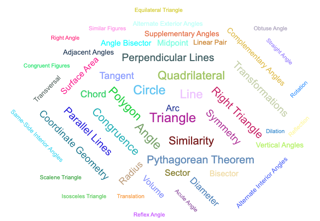

# About the AI Geometry Course

This website contains resources to help teach a high-school level course on geometry.

Our initial goal was to create a set of resources to demonstrate
how generative AI can be used to generate artifiacts used
in a high school geometry course.  For example:

1. A list of key concepts
2. A glossary of terms
3. A word cloud
4. A learning graph
5. Micro-simulations (MicroSims)

## How to Use the Website

1. Use the left navigation bar to view some of the content in the website
2. Use the search function at the top of the website to look for topics you are interested in
3. Use the learning graph MicroSim to see how concepts are related

We hope these resources are useful for both instructors and students.

