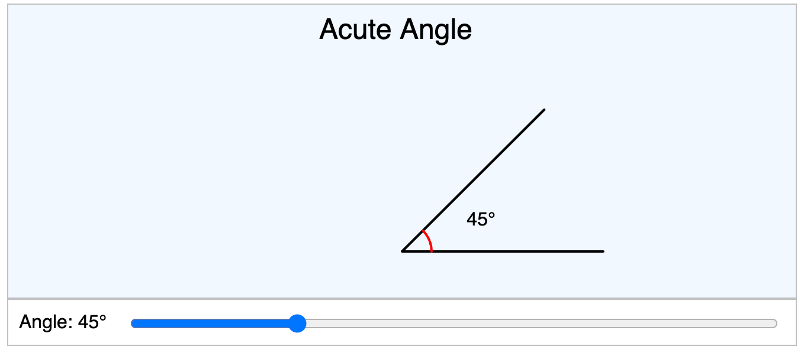

# Exploring Angles with the Angle Explorer MicroSim

<!--

-->

<iframe src="/geometry-course/sims/angle-explorer/angle-explorer.html" 
   width="630" height="309"></iframe>

[Run the Angle Explorer MicroSim](../../sims/angle-explorer/angle-explorer.html){ .md-button .md-button--primary }

**Grade Level:** 9th - 12th Grade Geometry

## Lesson Objectives

By the end of this lesson, students will be able to:

-  Understand and identify different types of angles: zero, acute, right, obtuse, and straight angles.
-  Use the Angle Explorer MicroSim to manipulate rays and observe how angle measures change dynamically.
-  Relate angle measures to their corresponding angle types.
-  Apply their understanding of angles to solve problems and recognize angles in real-world contexts.

## Key Concepts

- **Angle Measurement:** An angle is formed by two rays (sides) sharing a common endpoint (vertex). Angles are measured in degrees (°), ranging from 0° to 180° in this context.

- **Types of Angles:**

-   **Zero Angle (0°):** The rays overlap completely; there is no opening between them.
-   **Acute Angle (0° < angle < 90°):** An angle smaller than a right angle; the rays form a sharp point.
-   **Right Angle (90°):** An angle that forms a perfect "L" shape; the rays are perpendicular.
-   **Obtuse Angle (90° < angle < 180°):** An angle larger than a right angle but less than a straight angle.
-   **Straight Angle (180°):** The rays extend in opposite directions, forming a straight line.
-   **Dynamic Visualization:** Using interactive tools to manipulate geometric figures helps deepen understanding of geometric concepts.

## Materials Needed

-   Computers or tablets with internet access.
-   Access to the Angle Explorer MicroSim (the provided p5.js sketch).

## Lesson Activities

### 1. Introduction (10 minutes)

-   **Discussion:** Begin with a brief review of angles and their significance in geometry.
-   **Real-Life Examples:** Ask students where they see angles in everyday life (e.g., corners of a room, slices of pizza, hands of a clock).
-   **Objective Sharing:** Explain that today they will explore angles dynamically using the Angle Explorer MicroSim.

### 2. Exploring the MicroSim (10 minutes)

-   **Guided Tour:**

-   Show students how to access and run the MicroSim.
-   Demonstrate adjusting the angle using the slider at the bottom.
-   Point out the display of the angle measure and the angle type.

-   **Hands-On Exploration:**

-   Allow students time to experiment with the MicroSim independently.
-   Encourage them to observe how moving the slider affects the rays and angle measure.

### 3. Key Concepts Discussion (15 minutes)

-   **Zero Angle (0°):**

    -   **Activity:** Set the angle to 0°.
    -   **Observation:** Discuss how the rays overlap.
    -   **Question:** What happens when there is no angle between the rays?

-   **Acute Angles (1° - 89°):**

    -   **Activity:** Adjust the angle to 30°.
    -   **Observation:** Identify characteristics of acute angles.
    -   **Question:** How do acute angles appear compared to right angles?

-   **Right Angle (90°):**

    -   **Activity:** Set the angle to 90°.
    -   **Observation:** Note the perpendicular rays.
    -   **Question:** Why is the right angle significant in geometry?

-   **Obtuse Angles (91° - 179°):**

    -   **Activity:** Change the angle to 120°.
    -   **Observation:** Examine how obtuse angles differ from acute angles.
    -   **Question:** What real-world objects have obtuse angles?

-   **Straight Angle (180°):**

    -   **Activity:** Set the angle to 180°.
    -   **Observation:** The rays form a straight line.
    -   **Question:** How does a straight angle relate to a straight line?

### 4. Interactive Challenges (20 minutes)

-   **Challenge 1: Angle Identification**

    -   **Task:** Adjust the slider to find examples of each angle type.
    -   **Record:** For each angle type, note the angle measure and draw a sketch.
    -   **Share:** Discuss findings with a partner or small group.

-   **Challenge 2: Real-Life Connections**

    -   **Task:** Think of real-life examples that match each angle type.
    -   **Examples:**
        -   Acute Angle: A slice of pie.
        -   Right Angle: Corner of a book.
        -   Obtuse Angle: The hands of a clock at 10:10.
    -   **Share:** Present examples to the class.

### 5. Concept Application (15 minutes)

-   **Problem-Solving Activity:**

    -   **Scenario:** Using the MicroSim, imagine designing a piece of art that incorporates different angle types.
    -   **Task:** Create a plan that includes at least one of each angle type.
    -   **Explain:** Write a brief description of how each angle will be used in your design.

-   **Reflection Questions:**

    -   How does changing the angle measure affect the classification of the angle?
    -   What patterns do you notice as the angle increases from 0° to 180°?

### 6. Conclusion (5 minutes)

-   **Summary:** Recap the key concepts learned about angle measures and types.
-   **Questions:** Open the floor for any remaining questions or clarifications.
-   **Preview:** Inform students about the next lesson on angle relationships (e.g., complementary and supplementary angles).

## Things for Students to Try with the MicroSim

1.  **Exact Measures:**

Set the angle to specific measures (15°, 45°, 75°, etc.) and identify the angle type.

2.  **Transitional Angles:**

-   Observe what happens when the angle changes from 89° to 90°, and from 90° to 91°.
-   **Question:** How does the angle type classification change at these points?

3.  **Angle Sum Exploration:**

    -   Combine two angles by setting the slider to different positions and considering how they might add up to 180°.
    -   **Extension:** Discuss complementary (adding up to 90°) and supplementary angles (adding up to 180°).

4.  **Angle Bisectors:**

    -   Find the angle that is exactly half of a right angle.
    -   **Task:** Set the angle to 45° and discuss the concept of an angle bisector.

5.  **Dynamic Observation:**

    -   Slowly move the slider from 0° to 180° and watch the rays.
    -   **Question:** How does the movement of the ray relate to the increase in angle measure?

6.  **Creating Shapes:**

    -   Use specific angles to imagine forming shapes (e.g., triangles with angles summing to 180°).
    -   **Task:** Think about how different angles can come together to form various polygons.

## Assessment

-   **Informal Observation:** Monitor student engagement and understanding during activities.
-   **Class Participation:** Encourage students to ask questions and contribute to discussions.
-   **Exit Slip:** At the end of the lesson, have students write down:
    -   One thing they learned.
    -   One question they still have.

## Extension Activities

-   **Advanced Angle Types:**

    -   **Reflex Angles:** Discuss angles greater than 180° and how they would appear.
    -   **Full Rotation (360°):** Explore what happens when an angle completes a full circle.
-   **Real-World Applications:**

    -   Investigate how angles are used in fields like architecture, engineering, and art.
    -   **Project Idea:** Design a simple structure or piece of art that incorporates various angle types.
-   **Technology Integration:**

    -   Encourage students to modify the MicroSim code (if appropriate) to add features, such as displaying angle measures beyond 180°.

## Teacher's Notes

-   **Preparation:**

    -   Ensure all students have access to a device that can run the MicroSim.
    -   Test the MicroSim beforehand to familiarize yourself with its functionality.

-   **Differentiation:**

    -   **For Visual Learners:** Emphasize the visual changes in the angle as the slider moves.
    -   **For Kinesthetic Learners:** Have students use their arms to physically model different angles.

-   **Classroom Management:**

    -   Set clear expectations for device use.
    -   Encourage collaboration but monitor to keep students on task.

## Homework Assignment

-   **Worksheet on Angles:**
    -   Complete problems identifying and classifying angles in various diagrams.
    -   Draw and label examples of each angle type.
    -   **Challenge Question:** Find and photograph real-life examples of each angle type to share in the next class.

## Reflection and Feedback

-   Note which concepts were well understood and which need reinforcement.
-   Consider student feedback for improving future lessons.

## Student Feedback

Collect anonymous feedback on the MicroSim's effectiveness in enhancing understanding.

## Summary

By engaging with the Angle Explorer MicroSim, students gain hands-on experience manipulating and observing angles, making abstract concepts tangible and interactive. This lesson plan encourages exploration, critical thinking, and real-world connections, fostering a deeper understanding of geometry.