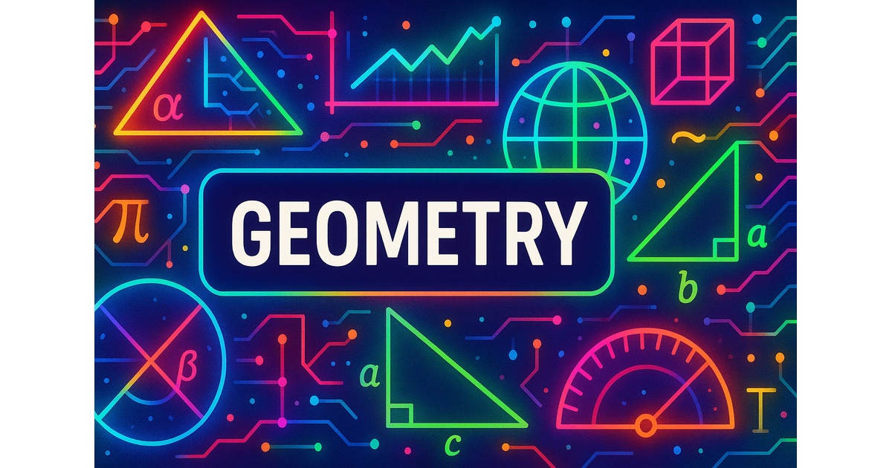

# Artificial Intelligence Assisted Geometry

{ width = "500px"}

Welcome to our website for an Artificial Intelligence (AI) 
assisted high school geometry course.

This website is designed to show how generative AI can work
with knowledge graphs to create personalized learning plans
for a typical high school geometry course.  It is the foundation
for an intelligent textbook for geometry.

This course also demonstrates how generative AI can be used
to create interactive animations and simulations using
[MicroSims](https://dmccreary.github.io/microsims/).
MicroSims are small simulations of the real world
that demonstrate learning concepts.  They can
be created and modified using generative AI tools
such as ChatGPT.  MicroSims can also be used to
display [Learning Graphs](https://dmccreary.github.io/learning-graphs/)
that display learning concepts and their dependencies.

We are looking for volunteers to help design MicroSims and
test the MicroSims in real classrooms.

Please contact me on [LinkedIn](https://www.linkedin.com/in/danmccreary/) if you
would like to help or if you have any questions about this course.

Thanks! - Dan
