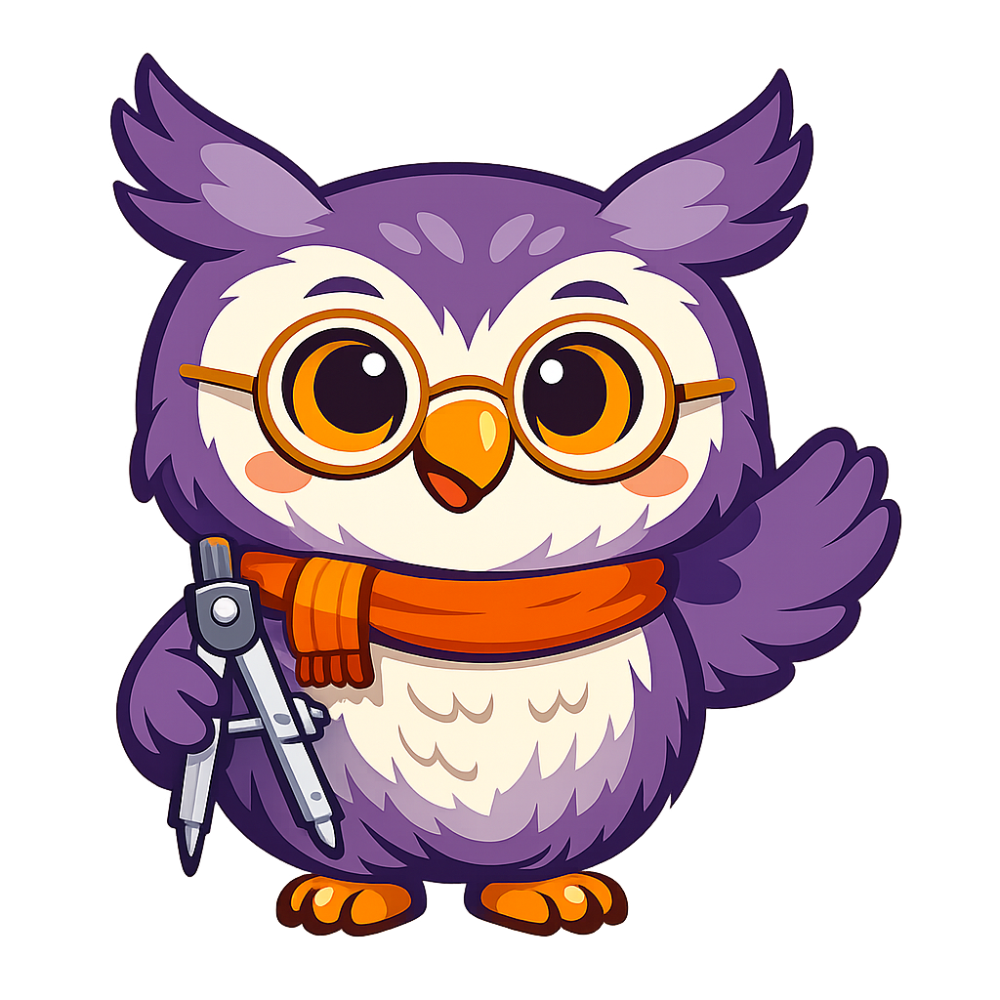
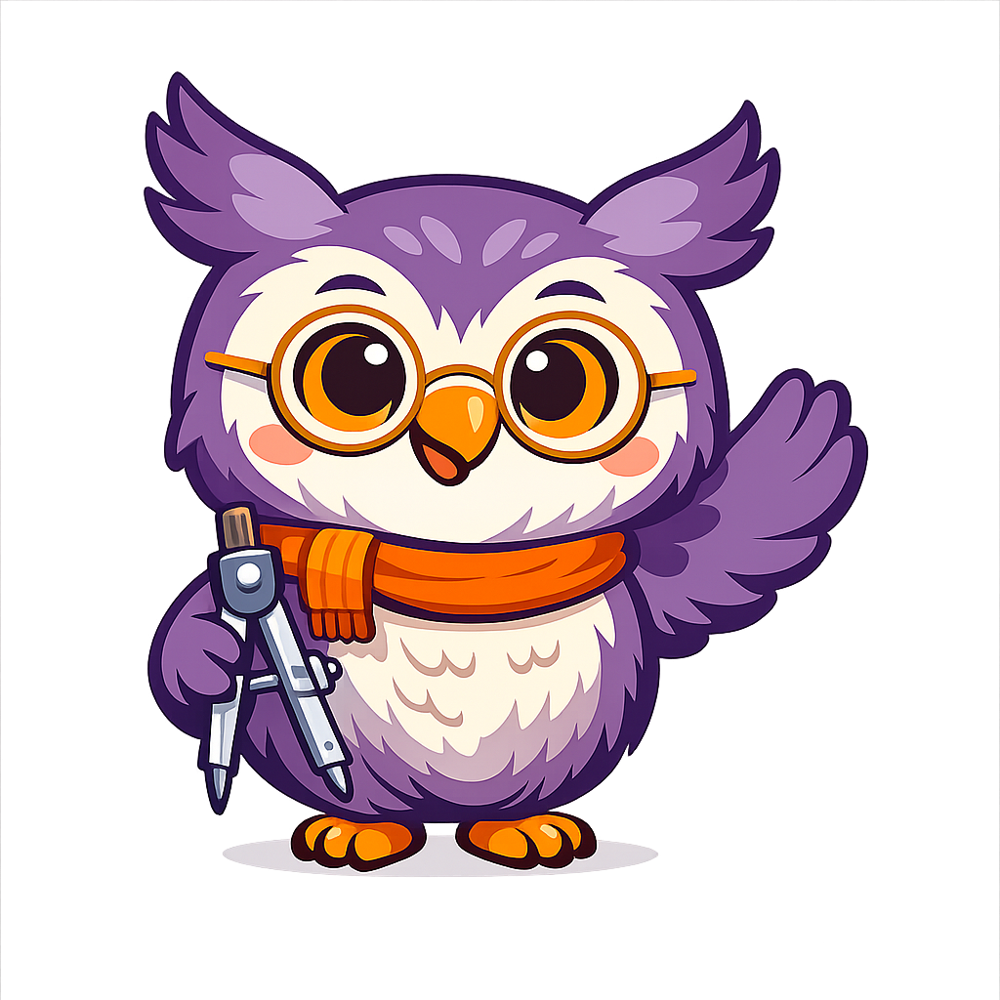
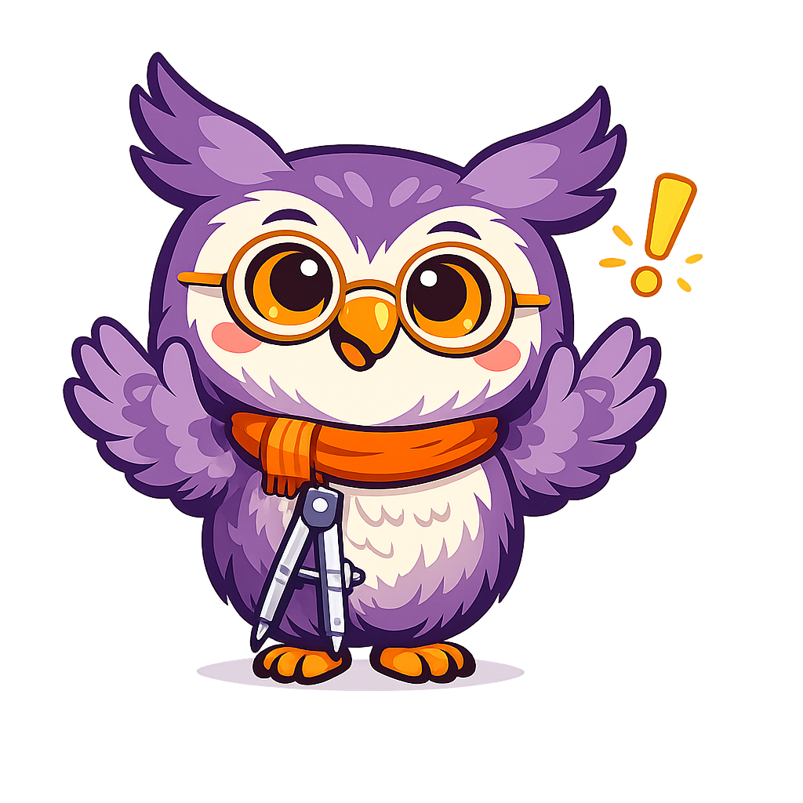
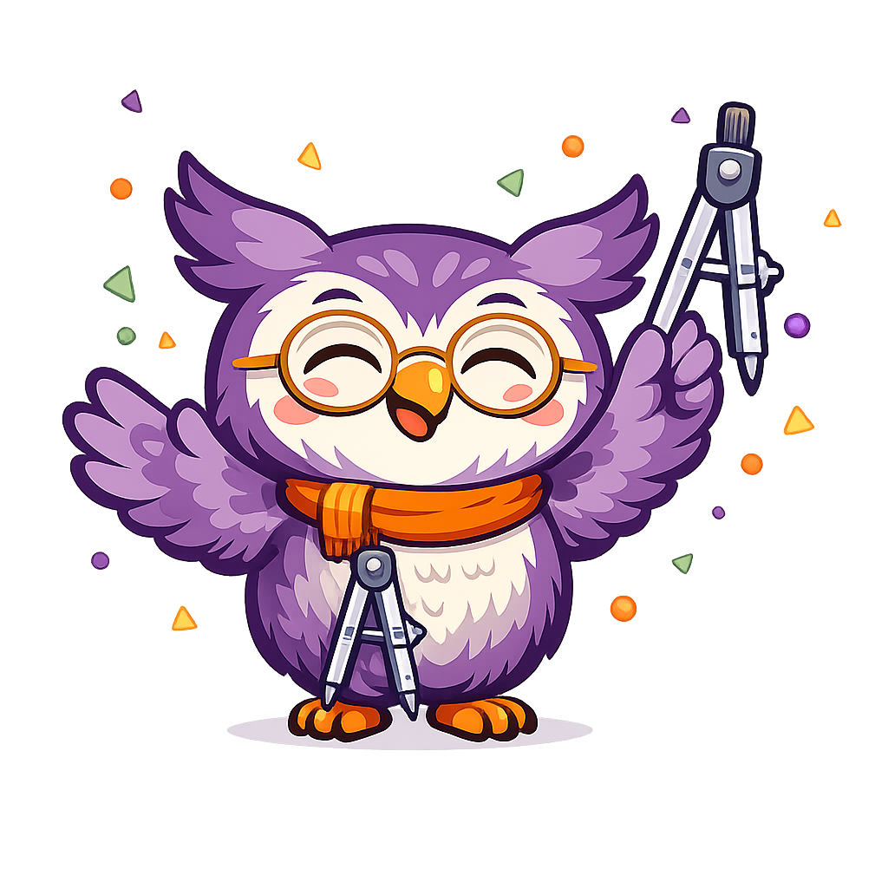

# GeoWise Style Guide

## Character Overview

| Attribute | Details |
|-----------|---------|
| **Name** | GeoWise |
| **Species** | Great horned owl (chibi-style) |
| **Role** | Pedagogical mascot and geometry guide |
| **Personality** | Warm, patient, encouraging, curious, slightly playful |
| **Catchphrase** | "Let's figure this out together!" |
| **Prop** | Silver geometric compass (drawing tool) |
| **Accessories** | Gold-rimmed round glasses, orange knit scarf |

{ width="200" }

## Color Palette

GeoWise's colors are drawn directly from the textbook's purple-and-orange MkDocs Material theme.

| Swatch | Color | Hex | Usage |
|--------|-------|-----|-------|
| | **Deep Purple** | `#7B1FA2` | Primary plumage, ear tufts, wings |
| | **Lavender Purple** | `#9C4DCC` | Plumage highlights, feather shading |
| | **Soft Lilac** | `#CE93D8` | Light feather accents, subtle gradients |
| | **Warm Orange** | `#FF9800` | Scarf, feet, beak, eye iris |
| | **Deep Orange** | `#E65100` | Scarf folds, beak shadow |
| | **Gold** | `#D4A017` | Glasses frames |
| | **Cream White** | `#FFF8E1` | Chest and belly feathers |
| | **Rosy Pink** | `#E8A0BF` | Cheek blush |
| | **Silver Gray** | `#90A4AE` | Compass tool, metallic accents |
| | **Dark Charcoal** | `#37474F` | Outlines, pupils |

### Theme Alignment

These colors map to the `mkdocs.yml` theme palette:

- **Primary (purple `#7B1FA2`)** — GeoWise's body, admonition borders, heading accents
- **Accent (orange `#FF9800`)** — GeoWise's scarf and feet, hover states, highlights

## Personality and Voice

### Core Traits

1. **Encouraging** — GeoWise never makes students feel bad for not understanding. Struggle is normal and celebrated as part of learning.
2. **Curious** — GeoWise models the joy of discovery. Questions are exciting, not intimidating.
3. **Patient** — GeoWise is happy to revisit ideas and break things into smaller steps.
4. **Empathetic** — GeoWise acknowledges when topics are hard and validates student effort.
5. **Playful** — GeoWise uses the occasional geometry pun or light humor to keep things fun without being distracting.

### Voice Characteristics

- Uses simple, encouraging language appropriate for grades 9-12
- Occasionally uses geometry-themed puns ("That's a-cute observation!" for acute angles)
- Refers to students as "we" to create a sense of partnership ("Let's see what happens when we...")
- Keeps dialogue brief — 1-3 sentences maximum per appearance
- Never talks down to students or uses overly childish language
- Acknowledges difficulty honestly ("This one takes practice — that's okay!")

### Signature Phrases

Use these phrases to trigger GeoWise styling in admonition titles:

| Phrase | Context |
|--------|---------|
| "Let's figure this out together!" | Chapter openings, new topics |
| "Here's a tip!" | Tips and helpful shortcuts |
| "Watch out!" | Common mistakes and pitfalls |
| "Great work!" | Celebrating progress |
| "You've got this!" | Encouragement during hard sections |
| "Think about it..." | Reflective questions and key insights |
| "Did you know?" | Interesting connections and fun facts |

### Tone by Context

| Situation | Tone | Example |
|-----------|------|---------|
| Introducing a chapter | Warm, welcoming | "Welcome back! Today we're going to explore something really cool about triangles." |
| Key concept | Curious, clear | "Think about it — if two angles add to 180 degrees, what does that tell us about the third?" |
| Helpful tip | Friendly, practical | "Here's a tip! Always label your diagrams. Future-you will thank present-you." |
| Common mistake | Gentle, reassuring | "Watch out! A lot of people mix up the radius and diameter at first. Let's make sure we've got it straight." |
| Hard section | Empathetic, steady | "This proof has a lot of steps — that's okay. Let's take it one piece at a time. You've got this!" |
| Celebrating progress | Proud, energetic | "Great work! You just proved two triangles are congruent. That's real mathematical reasoning!" |

## Admonition Usage for Chapter Content

GeoWise appears through custom-styled admonitions. When generating chapter content, use the following admonition types to bring GeoWise into the text.

### Admonition Types

| Type | Purpose | Icon Pose | Frequency |
|------|---------|-----------|-----------|
| `mascot-welcome` | Chapter openings, section introductions | Waving, cheerful | 1 per chapter |
| `mascot-thinking` | Key concepts, "aha" moments | Hand on chin, lightbulb | 2-3 per chapter |
| `mascot-tip` | Practical tips, shortcuts, study advice | Pointing upward | As needed |
| `mascot-warning` | Common mistakes, misconceptions | Hands up in "careful" gesture | As needed |
| `mascot-celebration` | Section completion, major milestones | Arms raised, confetti | End of major sections |
| `mascot-encourage` | Difficult content, persistence reminders | Thumbs up, warm smile | Where students may struggle |

### Markdown Syntax

```markdown
!!! mascot-welcome "Let's Figure This Out Together!"

    Welcome to our chapter on triangle congruence! By the end of this
    section, you'll be able to prove that two triangles are identical
    using just a few measurements. Let's dive in!

!!! mascot-thinking "Think About It..."

    If you know two sides and the angle between them, is that enough
    to determine the entire triangle? Spoiler: yes it is, and that's
    the power of the SAS postulate!

!!! mascot-tip "Here's a Tip!"

    When setting up a two-column proof, always start by listing what
    you're given and what you need to prove. It's like having a map
    before you start a journey.

!!! mascot-warning "Watch Out!"

    Don't confuse SSA with SAS! The order of the letters matters.
    SSA (Side-Side-Angle) is NOT a valid congruence criterion —
    it can produce two different triangles.

!!! mascot-celebration "Great Work!"

    You've mastered all five triangle congruence criteria! That's
    a huge milestone. These tools will serve you through the rest
    of geometry and beyond.

!!! mascot-encourage "You've Got This!"

    CPCTC proofs can feel like a lot of steps. That's completely
    normal — even experienced students take time with these.
    Break it into pieces and trust the process.
```

### Placement Rules

**Do:**

- Use `mascot-welcome` once at the start of each chapter
- Use `mascot-thinking` for 2-3 key conceptual insights per chapter
- Place `mascot-tip` near procedures, formulas, or study techniques
- Use `mascot-warning` near known misconceptions or tricky notation
- End major sections with `mascot-celebration` to mark progress
- Insert `mascot-encourage` before or during proof-heavy or abstract sections

**Don't:**

- Use more than 5-6 GeoWise admonitions per chapter
- Place two GeoWise admonitions back-to-back (space them out with content)
- Use GeoWise for purely decorative purposes with no meaningful message
- Change GeoWise's personality (e.g., sarcastic, impatient, or overly silly)
- Use GeoWise admonitions for standard content that doesn't need the mascot voice

### Balancing Mascot with Standard Admonitions

GeoWise admonitions supplement — not replace — the standard MkDocs Material admonitions. Use this decision guide:

| Content Type | Use GeoWise? | Use Standard? |
|--------------|-------------|---------------|
| Motivational encouragement | Yes (`mascot-encourage`) | No |
| Definition of a term | No | Yes (`!!! info`) |
| Formula reference | No | Yes (`!!! abstract`) |
| Common student mistake | Yes (`mascot-warning`) | Also fine as `!!! warning` |
| Worked example | No | Yes (`!!! example`) |
| Study strategy tip | Yes (`mascot-tip`) | Also fine as `!!! tip` |
| Chapter welcome | Yes (`mascot-welcome`) | No |
| Proof walkthrough | No | Yes (`!!! note`) |

## AI Image Prompt Templates

Use these prompts to generate additional GeoWise images with consistent style. Replace the `[POSE DESCRIPTION]` section for each variant.

### Base Prompt

```
A flat cartoon illustration of GeoWise the Owl, a friendly pedagogical
mascot for a high school geometry textbook. GeoWise is a round, plump
great horned owl with soft purple plumage (#7B1FA2) on his back and
wings, a cream-colored chest (#FFF8E1) with subtle feather texture,
and warm orange-amber eyes (#FF9800) that convey curiosity and kindness.
He wears small round gold-rimmed glasses perched on his beak and a tiny
orange knit scarf loosely draped around his neck. He has prominent ear
tufts with purple tips and rosy pink cheeks. His proportions are
chibi-style — large head relative to body, compact and icon-friendly.
Style: modern flat vector, clean outlines, minimal shading, solid color
fills, transparent background. No text in image.
```

### Pose Variants

**Welcome (chapter openings):**
```
[BASE PROMPT] GeoWise is waving one wing cheerfully at the viewer,
holding a silver geometric compass in the other wing. His expression
is warm and inviting, suggesting "welcome, let's get started."
```



**Thinking (key concepts):**
```
[BASE PROMPT] GeoWise has one wing on his chin in a thoughtful pose,
looking upward. A small lightbulb glows above his head. His geometric
compass rests at his side. The pose suggests curiosity and discovery.
```


Use the image path `docs/img/geowise-thinking.png`

**Tip (helpful advice):**
```
[BASE PROMPT] GeoWise is pointing upward with one wing feather as if
sharing an important tip. His expression is helpful and knowing. A
small star or sparkle appears near his pointing gesture. His compass
is tucked under the other wing.
```


Use the image path `docs/img/geowise-tip.png`


**Warning (common mistakes):**
```
[BASE PROMPT] GeoWise holds up both wings in a gentle "be careful"
gesture. His expression is concerned but caring — not scary. A small
exclamation mark floats nearby. His compass hangs from his scarf.
```



Use the path `docs/img/geowise-warning.png`

**Celebration (achievements):**
```
[BASE PROMPT] 
Please generate a new image variation for GeoWise.  This one is called "GeoWise Gives a Gentle Warning" GeoWise spreads both wings wide with joy, eyes squinted
in a big smile. Small confetti or geometric shapes (triangles, circles)
float around him. His compass is raised triumphantly in one wing.
```



Use the image path `docs/img/geowise-celebrates.png`

**Encouraging (difficult sections):**
```
[BASE PROMPT]
Please create a new variation of the GeoWise image called "GeoWise Encouraging". GeoWise gives a wing thumbs-up with a warm, reassuring
smile. His posture leans slightly toward the viewer as if saying
"you can do this." His compass rests at his side.
```


Use the image path `docs/img/geowise-encourage.png`

### Image Specifications

| Property | Value |
|----------|-------|
| Generation size | 1024 x 1024 px |
| Display size | 200 x 200 px (admonition body), 24 x 24 px (admonition icon) |
| Format | PNG with transparent background |
| Max file size | 100 KB per image |
| Storage location | `docs/img/mascot/` |

### File Naming Convention

```
docs/img/mascot/
├── welcome.png         # Chapter openings
├── thinking.png        # Key concepts
├── tip.png             # Tips and hints
├── warning.png         # Warnings and pitfalls
├── celebration.png     # Achievements
└── encouraging.png     # Difficult sections
```

## CSS Implementation

GeoWise admonitions use custom CSS that extends the MkDocs Material admonition system. The CSS file should be saved as `docs/css/mascot.css` and registered in `mkdocs.yml` under `extra_css`.

### CSS Variables

```css
:root {
  --geowise-purple: #7B1FA2;
  --geowise-orange: #FF9800;
  --geowise-cream: #FFF8E1;
  --geowise-lavender-bg: #F3E5F5;
  --geowise-orange-bg: #FFF3E0;
  --geowise-green: #66BB6A;
  --geowise-green-bg: #E8F5E9;
  --geowise-red: #EF5350;
  --geowise-red-bg: #FFEBEE;
  --geowise-deep-purple: #AB47BC;
  --geowise-deep-purple-bg: #F3E5F5;
  --geowise-blue: #29B6F6;
  --geowise-blue-bg: #E1F5FE;
  --geowise-icon-size: 1.2em;
}
```

### Admonition Color Mapping

| Admonition | Border / Title Background | Body Background |
|------------|--------------------------|-----------------|
| `mascot-welcome` | Purple `#7B1FA2` | Lavender `#F3E5F5` |
| `mascot-thinking` | Orange `#FF9800` | Light orange `#FFF3E0` |
| `mascot-tip` | Green `#66BB6A` | Light green `#E8F5E9` |
| `mascot-warning` | Red `#EF5350` | Light red `#FFEBEE` |
| `mascot-celebration` | Deep purple `#AB47BC` | Light purple `#F3E5F5` |
| `mascot-encourage` | Blue `#29B6F6` | Light blue `#E1F5FE` |

## CLAUDE.md Integration

Add the following section to the project's `CLAUDE.md` to ensure consistent GeoWise usage in AI-generated chapter content:

```markdown
## Learning Mascot: GeoWise the Owl

### Character
- **Name**: GeoWise
- **Species**: Great horned owl (chibi-style)
- **Personality**: Warm, patient, encouraging, curious, slightly playful
- **Catchphrase**: "Let's figure this out together!"
- **Visual**: Purple owl with gold-rimmed glasses, orange scarf, holding a geometric compass

### Voice Rules
- Simple, encouraging language for grades 9-12
- Uses "we" for partnership ("Let's see what happens...")
- 1-3 sentences max per appearance
- Never condescending, never overly childish
- Acknowledges difficulty honestly
- Occasional geometry puns are welcome

### Admonition Placement (per chapter)
- mascot-welcome: 1x at chapter opening
- mascot-thinking: 2-3x for key insights
- mascot-tip: as needed for practical advice
- mascot-warning: as needed for common mistakes
- mascot-celebration: 1x at end of major sections
- mascot-encourage: as needed for hard content
- TOTAL: no more than 5-6 GeoWise admonitions per chapter
- NEVER place two GeoWise admonitions back-to-back
```
