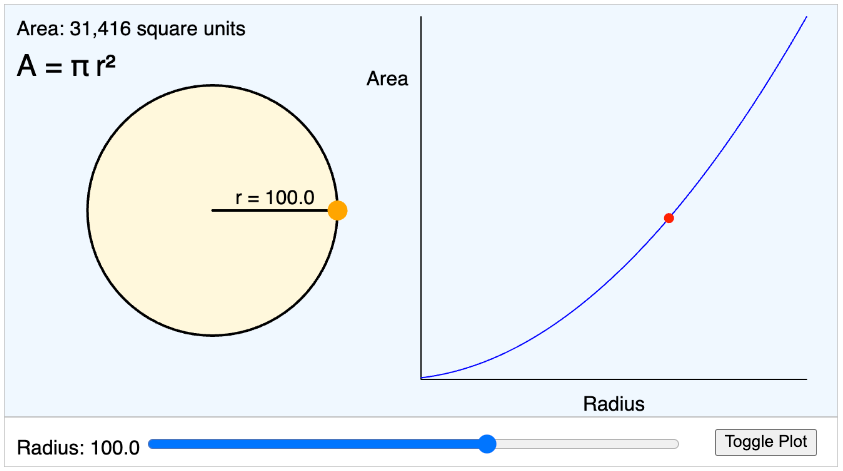

# Circle Area Explorer

[Run the Circle Area Explorer MicroSim](circle-area-explorer.html){ .md-button .md-button--primary }

[Run the Circle Area Explorer MicroSim V1](circle-area-explorer-v2.html)

[Edit theCircle Area Explorer MicroSim with the p5.js Editor](https://editor.p5js.org/dmccreary/sketches/yoCpStC96)

### Features:

1.  **Interactive Radius Slider and Direct Manipulation**:

- Adjusts the circle radius dynamically by allowing you to drag the radius or change the slider
- As you change the radius, the labels for radius and the area calculations are displayed
- You can turn on a graph to the right of the circle to display the relationship between the radius and the area
- You can show the quadratic shape of the curve

Illustrates how the area of the circle grows quadratically with increasing radius.

### Learning Outcomes:

-   Students visualize the quadratic relationship $A = \pi r^2$
-   Observe that area increases faster than the radius due to the quadratic term.

## References

* [Sample ChatGPT Dialog to generate the first version of the MicroSim](https://chatgpt.com/share/674dd14f-2834-8001-9b6b-a380dc79ae10)
* [Sample ChatGPT Dialog to add direct manipulation of the radius within the circle](https://chatgpt.com/share/674dd03a-7454-8001-af93-87f29e31f42c)

## Enhancements

Place a radius horizontal line in the circle and add the text of the radius at the midpoint of that line.
Allow the user to drag any point on the circle to change the radius.
