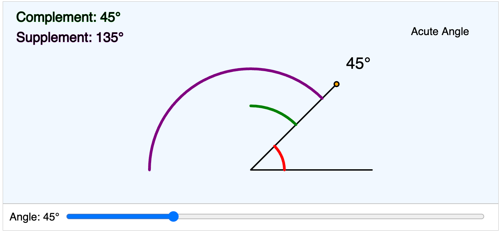

# Complementary and Supplementary Angles



[Run the Complementary and Supplementary MicroSim](./comp-and-sup-angles.html){ .md-button .md-button--primary }

[Edit the MicroSim on the p5.js editor website](https://editor.p5js.org/dmccreary/sketches/NnFw96a9w)

[Run the Complementary and Supplementary MicroSim V1](./comp-and-sup-angles-v1.html)

## Sample Prompt

```linenums="0"
Prompt Name: Complementary and Supplementary Angles in p5.js 

You are a expert at generating p5.js sketches to help students learn 
basic high-school level geometry. This p5.js sketch is part of a 
geometry course is offered to students in the 9th through 12th grade. 
Students have taken basic algebra courses and they understand equations. 
You are helping geometry teachers explain concepts in geometry. 
The topic this week is Complementary and Supplementary Angles.

Create a p5.js sketch that will
adjust the angle of a ray to and illustrate the idea of
Complementary and Supplementary Angles.

Use a slider placed in the bottom control area to adjust the angle.
Have the name of the angles change as the angle moves.

Use the following p5.js template
```

[MicroSim Template for 2D Geometry](../templates/microsim-2d-geometry.js)

## Response

```js
// Complementary and Supplementary Angles

// MicroSim Template for 2D geometry with region drawing parameters
// Use for an instructor standing in front of a "smart white board" with controls on the bottom
// Author: Dan McCreary
// Version geometry-1
// This template puts a control region below the active drawing region of the canvas
// the width of the entire canvas
// No HTML should be placed above the drawing region so the MicroSim can be placed on a page with an iFrame
let canvasWidth = 663;
// The top drawing region above the interactive controls
let drawWidth = canvasWidth;
let drawHeight = 300;
// the control region is where we place sliders and buttons
// height of the region that contains all the controls
let controlHeight = 40;
// The total height of both the drawing region height + the control region height
let canvasHeight = drawHeight + controlHeight;
// margin around the active plotting region
let margin = 25;
// the left margin area needs to hold the width of the text label and value
let sliderLeftMargin = 100;
// larger text so students in the back of the room can read the labels
let defaultTextSize = 16;

let mySlider;

function setup() {
    const canvas = createCanvas(canvasWidth, canvasHeight);
    var mainElement = document.querySelector('main');
    canvas.parent(mainElement);
    textSize(defaultTextSize);

    // create a new slider at the bottom of the canvas in the control region
    mySlider = createSlider(0, 180, 45, 1);
    // position the slider below the drawing region
    mySlider.position(sliderLeftMargin, drawHeight + 17);
    // make the slider width fill the area to the right of the label and value of the slider
    mySlider.size(canvasWidth - sliderLeftMargin - 15);
}

function draw() {
    // make the background drawing region a very light blue
    fill('aliceblue');
    // draw a thin light gray outline for the region borders
    stroke('silver');
    rect(0, 0, canvasWidth, drawHeight);
    // make the background of the controls area white
    fill('white');
    rect(0, drawHeight, canvasWidth, controlHeight);
    noStroke();

    // get the updated slider value
    let mySliderValue = mySlider.value();

    // Define center and ray length
    let cx = canvasWidth / 2;
    let cy = drawHeight - 50;
    let rayLength = 180;

    // Compute angle in radians
    let theta = radians(mySliderValue);

    // Compute end point of moving ray
    let x_end = cx + rayLength * cos(theta);
    let y_end = cy - rayLength * sin(theta);

    // Draw fixed ray along x-axis
    stroke('black');
    strokeWeight(2);
    line(cx, cy, cx + rayLength, cy);

    // Draw moving ray
    line(cx, cy, x_end, y_end);
    fill('orange');
    circle(x_end, y_end, 7);

    // Draw primary angle arc in red from 0 to theta
    noFill();
    stroke('red');
    strokeWeight(4);
    // 0 to theta
    arc(cx, cy, 100, 100, -theta, 0, OPEN);

    // Draw complementary angle arc in green if applicable
    //.Go from theta to 90
    if (mySliderValue < 90) {
        stroke('green');
        arc(cx, cy, 190, 190, -PI/2, -theta, OPEN);
    }

    // Draw supplementary angle arc in purple if applicable
    // draw from theta to 180
    if (mySliderValue < 180) {
        stroke('purple');
        arc(cx, cy, 300, 300, -PI, -theta, OPEN);
    }

    // Reset stroke weight
    strokeWeight(1);

    // Display angle value
    fill('black');
    noStroke();
    textSize(24);
    // Place the text near the ray endpoint circle but opposite the center
    let offset = 20; // Adjust the distance of the text from the circle
    let textX = x_end + cos(-theta) * offset; // Offset along the angle
    let textY = y_end + sin(-theta) * offset *1.1 - 7; // Offset along the angle
    text(mySliderValue + "°", textX, textY);
    // Determine angle name
    let angleName = "";
    if (mySliderValue == 0) {
        angleName = "Zero Angle";
    } else if (mySliderValue < 90) {
        angleName = "Acute Angle";
    } else if (mySliderValue == 90) {
        angleName = "Right Angle";
    } else if (mySliderValue < 180) {
        angleName = "Obtuse Angle";
    } else if (mySliderValue == 180) {
        angleName = "Straight Angle";
    }

    // Display angle name in upper right
    textSize(16);
    text(angleName, drawWidth - 130, 50);
  
    stroke('green');
    // Compute and display complement
    let complementText = "";
    if (mySliderValue < 90) {
        let complement = 90 - mySliderValue;
        complementText = "Complement: " + complement + "°";
    } else if (mySliderValue == 90) {
        complementText = "Complement: None";
    } else {
        complementText = "Complement: N/A";
    }
    textSize(20);
    text(complementText, 20, 30);

    stroke('purple');
    // Compute and display supplement
    let supplementText = "";
    if (mySliderValue < 180) {
        let supplement = 180 - mySliderValue;
        supplementText = "Supplement: " + supplement + "°";
    } else if (mySliderValue == 180) {
        supplementText = "Supplement: None";
    } else {
        supplementText = "Supplement: N/A";
    }
    text(supplementText, 20, 60);

    // Draw label and value
    noStroke();
    textSize(16);
    fill('black');
    text("Angle: " + mySliderValue + "°", 10, drawHeight + 25);
}
```

## Description

This code implements a **MicroSim** for teaching **complementary and supplementary angles** using p5.js. The MicroSim is designed to run in a browser and provides interactive functionality, including a slider that allows the user to change the angle dynamically. Key features include:

### 1. **Canvas Layout**:

Divided into two main regions:

- **Drawing Region**: Displays the angle visualization.
- **Control Region**: Contains interactive controls (slider) for adjusting the angle.

Properly structured for embedding in an iFrame without external HTML interference.

### 2. **Visualization**:

A static ray representing the x-axis.

A dynamic ray that rotates according to the slider value.

The dynamic ray's angle is visualized with arcs:

- **Primary angle** (red).
- **Complementary angle** (green).
- **Supplementary angle** (purple).

The end of the dynamic ray is marked with an orange circle.

### 3. **Feedback and Display**:

- Angle values and names (e.g., Acute, Right) displayed dynamically based on the slider value.
- Complements and supplements are computed and displayed, with appropriate handling for special cases (e.g., "None" for angles 90° and 180°).

### 4. **User Interaction**:

A slider to select angles from 0° to 180°.

Text and arcs update in real-time as the slider is adjusted.

### 5. **Customization**:

Parameters like canvas size, text size, and margins are defined at the top for easy configuration.