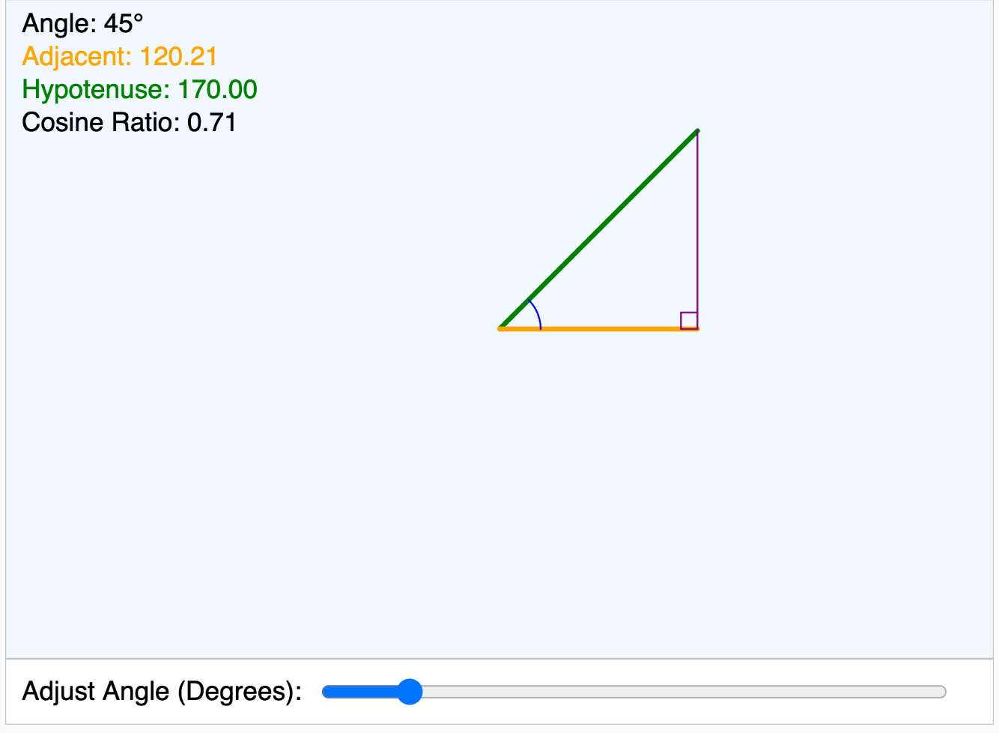

# Cosine as the Ratio of Two Sides of a Triangle

<iframe src="main.html" width="100%" height="450px" scrolling="no"></iframe>

[Run the Cosine MicroSim Fullscreen](./main.html){ .md-button .md-button--primary }

[Edit this MicroSim in the p5.js Editor](https://editor.p5js.org/dmccreary/sketches/4u1wiQds8){ .md-button }

**Copy this iframe to embed in your website:**

```html
<iframe src="https://dmccreary.github.io/geometry-course/sims/cosine/main.html" width="100%" height="450px" scrolling="no"></iframe>
```

## Description

This MicroSim demonstrates how the cosine can be visualized as the ratio of the adjacent side to the hypotenuse in a right triangle. Students can adjust the angle and observe how the cosine value changes.



## Cosine With Plot

[Run the Cosine With Plot MicroSim](./cosine-with-plot.html){ .md-button .md-button--primary }

[Edit the Cosine With Plot MicroSim in the p5.js Editor](https://editor.p5js.org/dmccreary/sketches/-fGcn6AxM){ .md-button }
