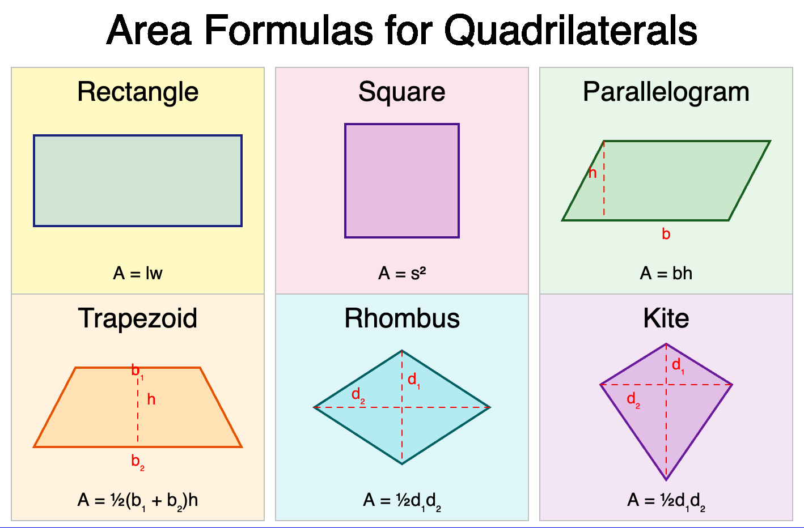
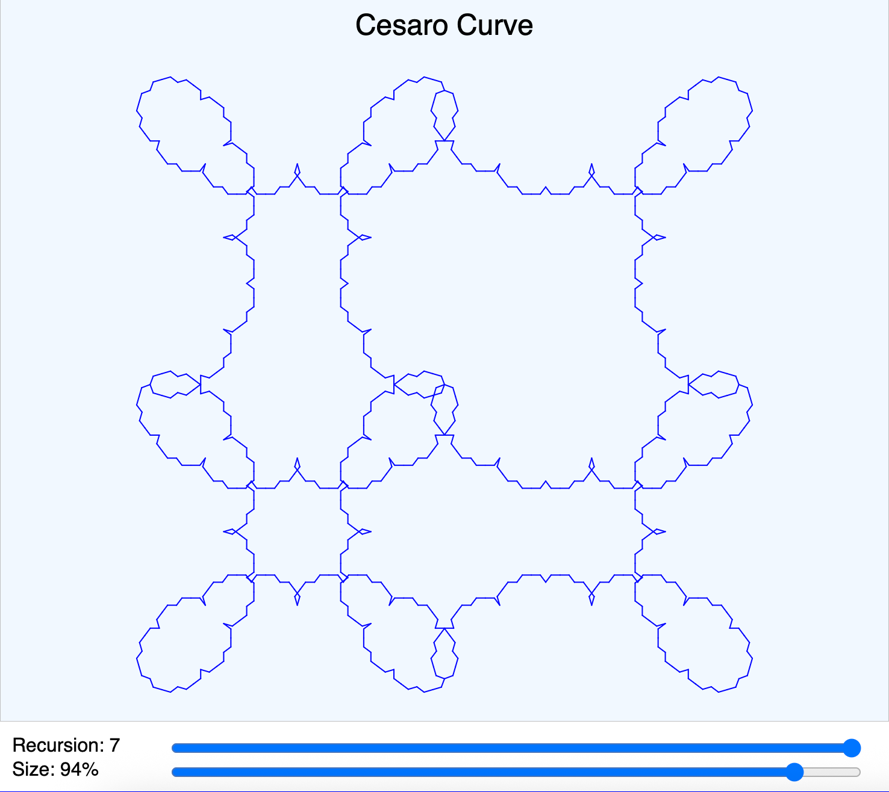
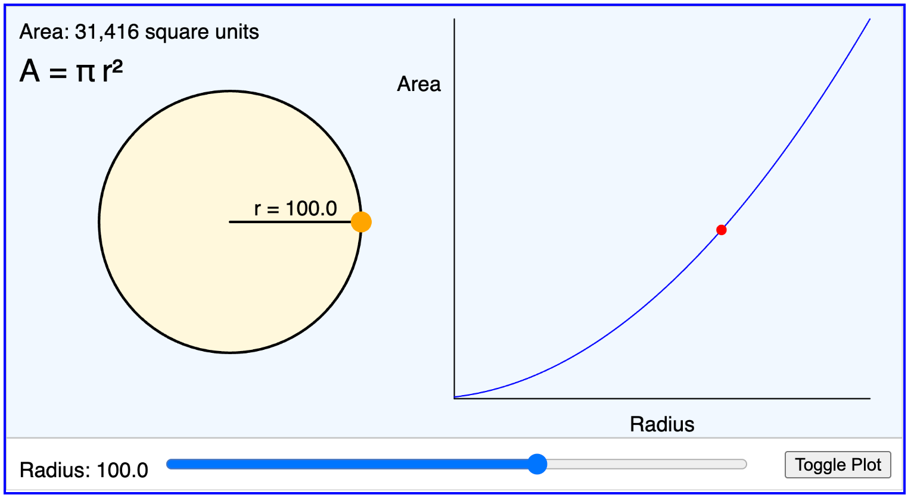
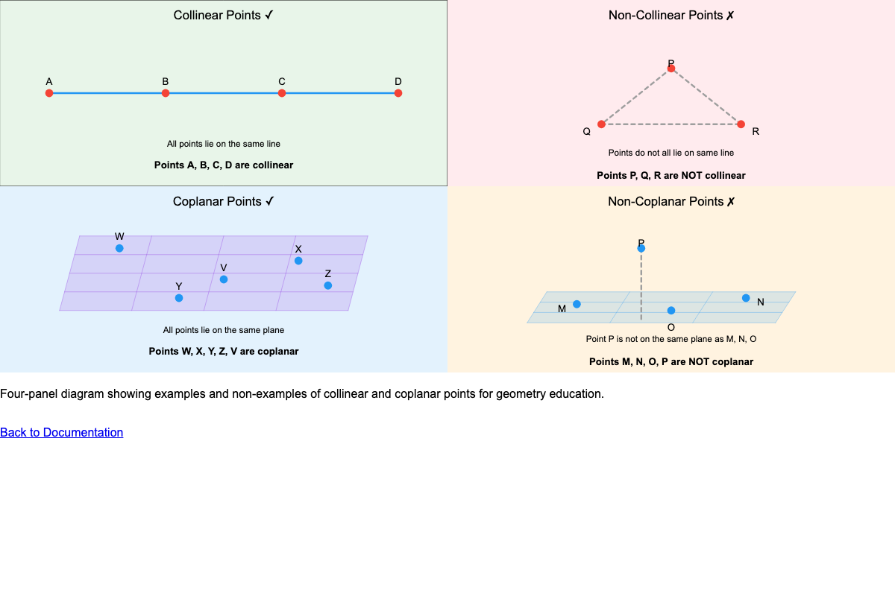
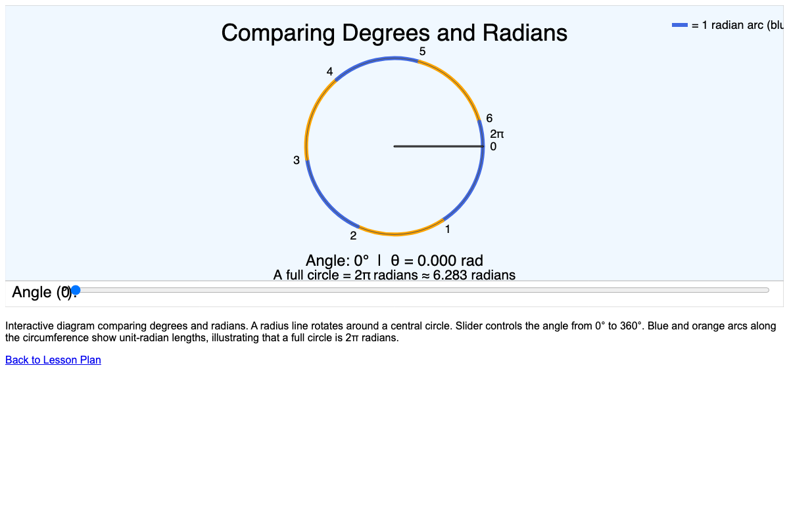
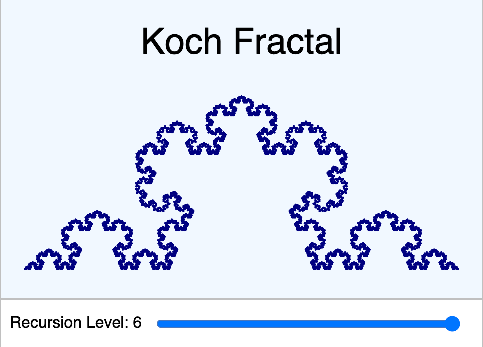
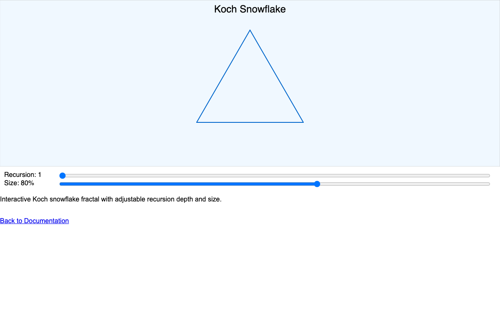
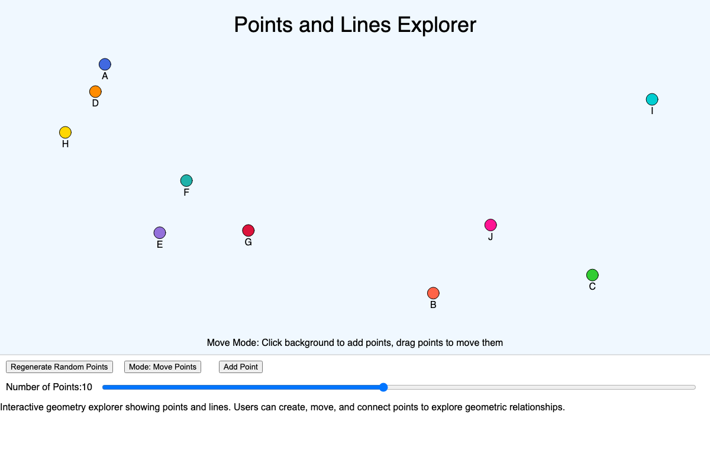
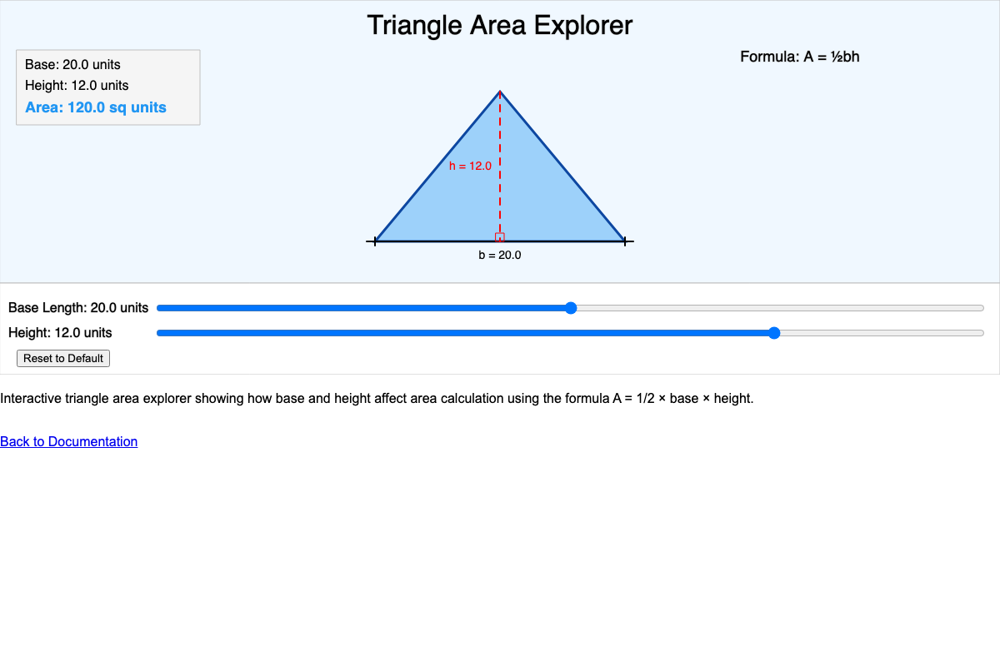

# MicroSims for Geometry

Interactive simulations to explore geometric concepts through hands-on manipulation and visual feedback.

- **[Angle Pairs](./angle-pairs/index.md)**

    

    Explore different angle pair relationships including vertical angles, linear pairs, corresponding angles, and alternate angles formed by parallel lines and transversals.

- **[Angle Type Explorer](./angle-type-explorer/index.md)**

    

    Discover angle classifications by manipulating a slider to create acute, right, obtuse, straight, and reflex angles with real-time visual feedback.

- **[Area Formulas for Quadrilaterals](./area-formulas-quadrilaterals/index.md)**

    

    Compare area formulas for different quadrilaterals including squares, rectangles, parallelograms, rhombuses, and trapezoids.

- **[Barnsley's Fern](./barnsleys-fern/index.md)**

    

    Explore the Barnsley fern fractal created using an Iterated Function System. Adjust iterations, scale, leaf angle, and curl to create different fern variations.

- **[Cesaro Curve](./cesaro-curve/index.md)**

    

    Explore the Cesaro curve (torn square) fractal. Starting from a divided square, watch how perpendicular displacement creates intricate lace-like patterns.

- **[Circle Area Calculator](./circle-area-calculator/index.md)**

    

    Calculate and visualize circle area by adjusting the radius. See how the area formula A = πr² produces the result in real-time.

- **[Circle Area Explorer](./circle-area-explorer/index.md)**

    

    Investigate the relationship between a circle's radius and its area through interactive manipulation and visual demonstration.

- **[Collinear and Coplanar Points](./collinear-coplanar-points/index.md)**

    

    Understand the concepts of collinear points (on the same line) and coplanar points (on the same plane) through interactive 3D visualization.

- **[Complementary and Supplementary Angles](./comp-and-sup-angles/index.md)**

    

    Explore angle relationships: complementary angles (sum to 90°) and supplementary angles (sum to 180°) with interactive sliders.

- **[Cosine Function](./cosine/index.md)**

    

    Visualize the cosine function on the unit circle. See how the x-coordinate of a point on the circle relates to the cosine of the angle.

- **[Degrees vs Radians](./degrees-vs-radians/index.md)**

    

    Convert between degree and radian angle measurements. Understand the relationship between these two common ways to measure angles.

- **[Distance Formula Explorer](./distance-formula/index.md)**

    

    Calculate the distance between two points on a coordinate plane using the distance formula derived from the Pythagorean theorem.

- **[Graph Viewer](./graph-viewer/index.md)**

    

    Explore the geometry course learning graph showing 200 concepts and their dependencies. Navigate through foundational concepts to advanced topics.

- **[Koch Fractal](./koch-fractal/index.md)**

    

    Explore the Koch curve fractal. Watch how a simple line transforms into an increasingly complex pattern through recursive subdivision.

- **[Koch Snowflake](./koch-snowflake/index.md)**

    

    Create the classic Koch snowflake by applying the Koch curve to each side of a triangle. Adjust recursion depth to see the fractal evolve.

- **[Levy C Curve](./levy-c-curve/index.md)**

    

    Explore the Levy C curve (flowsnake), a space-filling fractal that uses 45-degree angles and eventually fills a 2D region.

- **[Line Relationships 3D](./line-relationships-3d/index.md)**

    

    Visualize relationships between lines in 3D space including parallel, intersecting, perpendicular, and skew lines.

- **[Make Lines Parallel](./make-lines-parallel/index.md)**

    

    Adjust line parameters to make two lines parallel. Understand what conditions must be met for lines to never intersect.

- **[Peano-Gosper Fractal](./peano-gosper-fractal/index.md)**

    

    Explore the Gosper curve (flowsnake), a space-filling fractal based on hexagonal geometry using L-system rules and turtle graphics.

- **[Point Line Explorer](./point-line-explorer/index.md)**

    

    Investigate the relationship between points and lines. Explore concepts like distance from a point to a line and point position relative to lines.

- **[Point, Line, Plane](./point-line-plane/index.md)**

    

    Understand the fundamental building blocks of geometry: points (0D), lines (1D), and planes (2D) through interactive 3D visualization.

- **[Pythagorean Theorem](./pythagorean-theorem/index.md)**

    

    Explore the Pythagorean theorem (a² + b² = c²) visually. See how squares on the sides of a right triangle relate to each other.

- **[Regular Polygon Explorer](./regular-polygon-explorer/index.md)**

    

    Investigate regular polygons from triangles to dodecagons. Explore interior angles, exterior angles, and the relationship between sides and angles.

- **[Regular Polygon Quiz](./regular-polygon-explorer-quiz/index.md)**

    

    Test your knowledge of regular polygons with an interactive quiz covering sides, interior angles, and exterior angles.

- **[Sierpinski Carpet](./sierpinski-carpet/index.md)**

    

    Explore the Sierpinski carpet, a 2D fractal created by recursively removing the center of a 3×3 grid, leaving 8 squares each time.

- **[Sierpinski Triangles](./sierpinski-triangles/index.md)**

    

    Create the Sierpinski triangle fractal by recursively removing the center triangle from each remaining triangle.

- **[Sine and Cosine Circle](./sine-and-cosine-circle/index.md)**

    

    Visualize sine and cosine on the unit circle. See how a point's coordinates relate to trigonometric functions as it moves around the circle.

- **[Soccer Ball](./soccer-ball/index.md)**

    

    Explore the geometry of a soccer ball (truncated icosahedron) made of pentagons and hexagons using 3D WebGL visualization.

- **[Triangle Area Explorer](./triangle-area-explorer/index.md)**

    

    Investigate triangle area using the formula A = ½bh. Manipulate the base and height to see how the area changes.

## Using MicroSims in the Classroom

MicroSims (micro-simulations) are interactive visualizations that help students explore geometric concepts through hands-on manipulation and immediate visual feedback.

### Learning Objectives

By using MicroSims, students will be able to:

- Visualize abstract geometric concepts through interactive manipulation
- Discover geometric relationships through exploration and experimentation
- Connect formal definitions to visual representations
- Develop intuition about geometric properties and relationships

### Instructional Strategies

1. **Guided Exploration**: Demonstrate the MicroSim and guide initial exploration with questions
2. **Discovery Learning**: Allow students to discover relationships independently
3. **Concept Reinforcement**: Connect exploration to formal definitions and theorems

### Best Practices

- Allow time for free exploration before structured tasks
- Encourage students to make and test predictions
- Use MicroSims to supplement, not replace, traditional instruction
- Connect virtual manipulations to real-world applications
