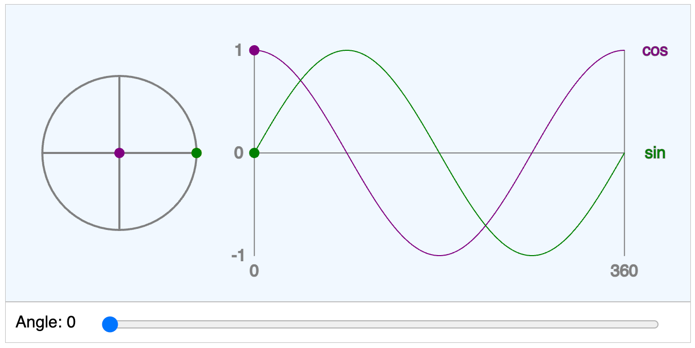

# Sine and Cosine Circle

<iframe src="main.html" width="100%" height="450px" scrolling="no"></iframe>

[Run the Sine and Cosine Circle MicroSim Fullscreen](./main.html){ .md-button .md-button--primary }

**Copy this iframe to embed in your website:**

```html
<iframe src="https://dmccreary.github.io/geometry-course/sims/sine-and-cosine-circle/main.html" width="100%" height="450px" scrolling="no"></iframe>
```

## Description

This MicroSim demonstrates the relationship between a point moving around the unit circle and the corresponding sine and cosine values. Students can observe how the x-coordinate (cosine) and y-coordinate (sine) of a point on the circle create the familiar sine and cosine wave patterns.



## Sample Prompt

From the p5.js site we have the following example code:


Modify this p5.js code to use a slider to change the angle.  Use the template below it for formatting.

```javascript
let circleX = 200;
let circleY = 150;
let circleRadius = 75;

let graphX = 50;
let graphY = 300;
let graphAmplitude = 50;
let graphPeriod = 300;

function setup() {
  createCanvas(400, 400);
  angleMode(DEGREES);
  describe(
    'Animated demonstration of a point moving around the unit circle, together with the corresponding sine and cosine values moving along their graphs.'
  );
}

function draw() {
  background(0);

  // Set angle based on frameCount, and display current value

  let angle = frameCount % 360;

  fill(255);
  textSize(20);
  textAlign(LEFT, CENTER);
  text(`angle: ${angle}`, 25, 25);

  // Draw circle and diameters

  noFill();
  stroke(128);
  strokeWeight(3);
  circle(circleX, circleY, 2 * circleRadius);
  line(circleX, circleY - circleRadius, circleX, circleY + circleRadius);
  line(circleX - circleRadius, circleY, circleX + circleRadius, circleY);

  // Draw moving points

  let pointX = circleX + circleRadius * cos(angle);
  let pointY = circleY - circleRadius * sin(angle);

  line(circleX, circleY, pointX, pointY);

  noStroke();

  fill('white');
  circle(pointX, pointY, 10);

  fill('orange');
  circle(pointX, circleY, 10);

  fill('red');
  circle(circleX, pointY, 10);

  // Draw graph

  stroke('grey');
  strokeWeight(3);
  line(graphX, graphY, graphX + 300, graphY);
  line(graphX, graphY - graphAmplitude, graphX, graphY + graphAmplitude);
  line(
    graphX + graphPeriod,
    graphY - graphAmplitude,
    graphX + graphPeriod,
    graphY + graphAmplitude
  );

  fill('grey');
  strokeWeight(1);
  textAlign(CENTER, CENTER);
  text('0', graphX, graphY + graphAmplitude + 20);
  text('360', graphX + graphPeriod, graphY + graphAmplitude + 20);
  text('1', graphX / 2, graphY - graphAmplitude);
  text('0', graphX / 2, graphY);
  text('-1', graphX / 2, graphY + graphAmplitude);

  fill('orange');
  text('cos', graphX + graphPeriod + graphX / 2, graphY - graphAmplitude);
  fill('red');
  text('sin', graphX + graphPeriod + graphX / 2, graphY);

  // Draw cosine curve

  noFill();
  stroke('orange');
  beginShape();
  for (let t = 0; t <= 360; t++) {
    let x = map(t, 0, 360, graphX, graphX + graphPeriod);
    let y = graphY - graphAmplitude * cos(t);
    vertex(x, y);
  }
  endShape();

  // Draw sine curve

  noFill();
  stroke('red');
  beginShape();
  for (let t = 0; t <= 360; t++) {
    let x = map(t, 0, 360, graphX, graphX + graphPeriod);
    let y = graphY - graphAmplitude * sin(t);
    vertex(x, y);
  }
  endShape();

  // Draw moving line

  let lineX = map(angle, 0, 360, graphX, graphX + graphPeriod);
  stroke('grey');
  line(lineX, graphY - graphAmplitude, lineX, graphY + graphAmplitude);

  // Draw moving points on graph

  let orangeY = graphY - graphAmplitude * cos(angle);
  let redY = graphY - graphAmplitude * sin(angle);

  noStroke();

  fill('orange');
  circle(lineX, orangeY, 10);

  fill('red');
  circle(lineX, redY, 10);
}
```

## MicroSim Template

```javascript
// Sample MicroSim Template for 2D Geometry

// MicroSim Template for 2D geometry with region drawing parameters
// Use for an instructor standing in front of a "smart white board" with conrols on the bottom
// Author: Dan McCreary
// Version geometry-1
// This template puts a control region below the active drawing region of the canvas
// the width of the entire canvas
// No HTML should be placed above the drawing region so the MicroSim can be placed on a page with an iFrame
let canvasWidth = 600;
// The top drawing region above the interactive controls
let drawWidth = canvasWidth;
let drawHeight = 400;
// the control region os where we place sliders and buttons
// height of the region that contains all the controls
let controlHeight = 40;
// The total hight of both the drawing region height + the control region height
let canvasHeight = drawHeight + controlHeight;
// margin around the active plotting region
let margin = 25;
// the left margin area needs to hold the width of the text label and value
let sliderLeftMargin = 130;
// larger text so students in the back of the room can read the labels
let defaultTextSize = 16;

function setup() {
    const canvas = createCanvas(canvasWidth, canvasHeight);
    // canvas.parent('canvas-container');
    var mainElement = document.querySelector('main');
    canvas.parent(mainElement);
    textSize(defaultTextSize);

    // create a new slider at th bottom of the canvas in the control region
    mySlider = createSlider(0, 300, 100, 1);
    // position the slider below the drawing region
    mySlider.position(sliderLeftMargin, drawHeight + 20);
    // make the slider width fill the area to the right of the label and value of the slider
    mySlider.size(canvasWidth - sliderLeftMargin - 30);
}

function draw() {
    // make the background drawing region a very light blue
    fill('aliceblue');
    // draw a thin light gray outline for the region borders
    stroke('silver');
    rect(0, 0, canvasWidth, drawHeight);
    // make the background of the controls area white
    fill('white')
    rect(0, drawHeight, canvasWidth, controlHeight);

    // get the updated slider value
    mySliderValue = mySlider.value();

    // put any drawing code here
    // draw a blue circle
    fill('blue');
    circle(canvasWidth/2, drawHeight/2, mySliderValue);

    // put your custom code here
    
    // draw label and value
    fill('black');
    text("MySlider: " +  mySliderValue, 10, drawHeight + 25)
}
```

## References

[Angles and Motion Sine and Cosine from p5.js examples site.](https://p5js.org/examples/angles-and-motion-sine-cosine/)
