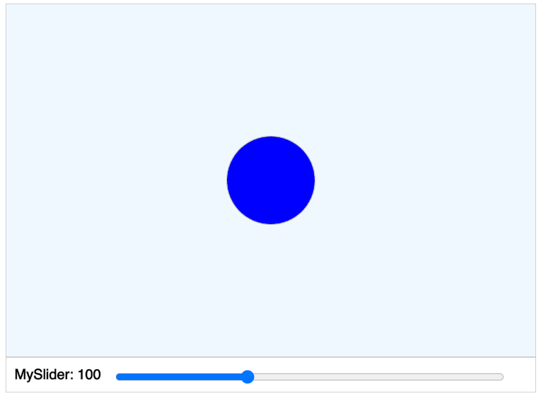

# MicroSim Templates for a Geometry Course

Our templates allow generative AI systems to start
with a working program that has a consistent
layout and a consistent look and feel.  Our
teachers have a strong preference for putting
controls like buttons and sliders at the bottom
of the screen with the labels and values to
the left of the sliders.

We also use a template that allows us to position
the animation at any specific part of a web page
using a iFrame with other content around the simulation.

We also prefer a minimalistic approach that allows
a simulation to be placed directly in a web page
with a single HTML iframe element where the user
just specifies the width and height of the simulation
with the page.  By minimalistic, we mean we don't
put a lot of HTML outside the canvas drawing area.

## Geometry p5.js Template #1

This template has a drawing region above
a control region.  We place buttons and sliders only
in the control region.  The width of the canvas is
set to be 

# MicroSim Template

{ width="400" }

[Run the MicroSim Template](./template.html){ .md-button .md-button--primary }
[Edit this MicroSim](https://editor.p5js.org/dmccreary/sketches/dJq4nTXE4)

## About this MicroSim

This MicroSim teaches us how to
specify the drawing of a static filled circle.

## Example iFrame

<iframe src="template.html" width="620" height="455" scrolling="no"></iframe>

## Sample Prompt

```linenums="0"
Create a single file p5.js sketch.
Draw a green circle on a 600x400 canvas with a radius of 200.
```

## Sample Response

```javascript
// canvas regions setup
```

## Checklists

### Basic

1. Link to the MicroSim html in the index.md file
2. Image of the MicroSim in the index.md file